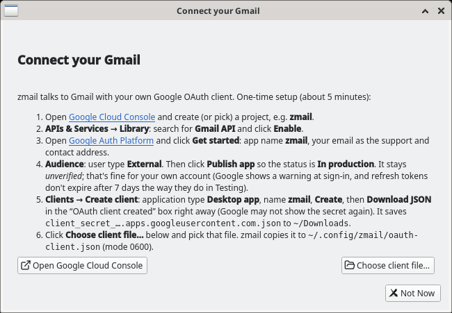
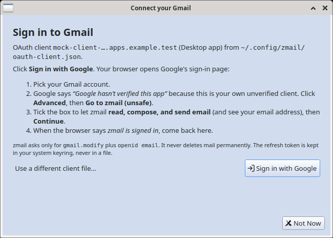
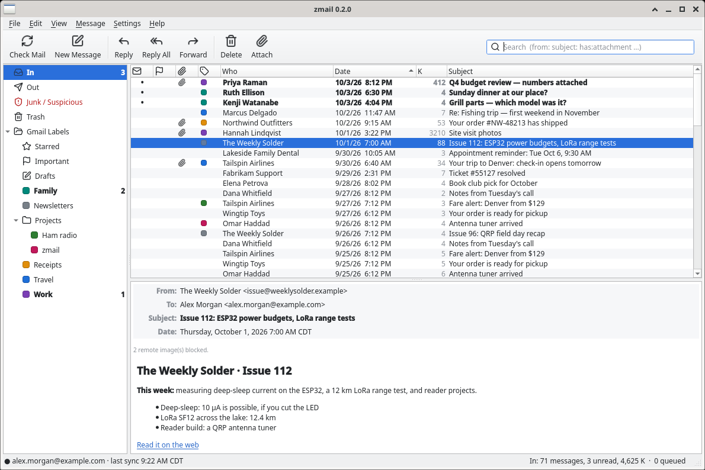
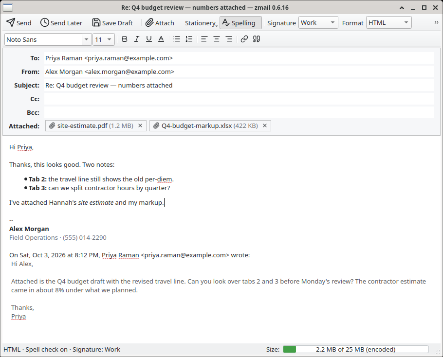
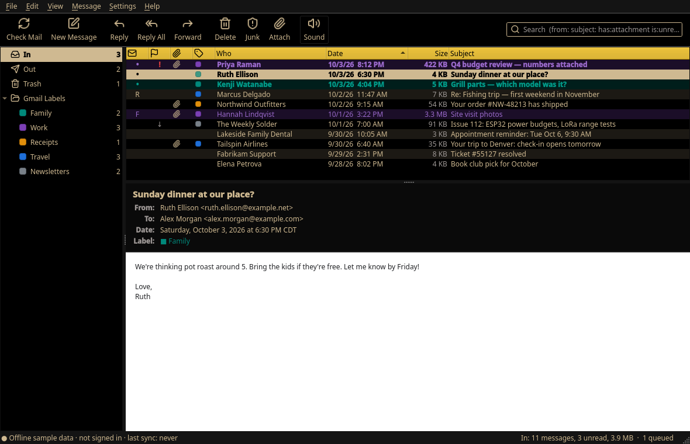
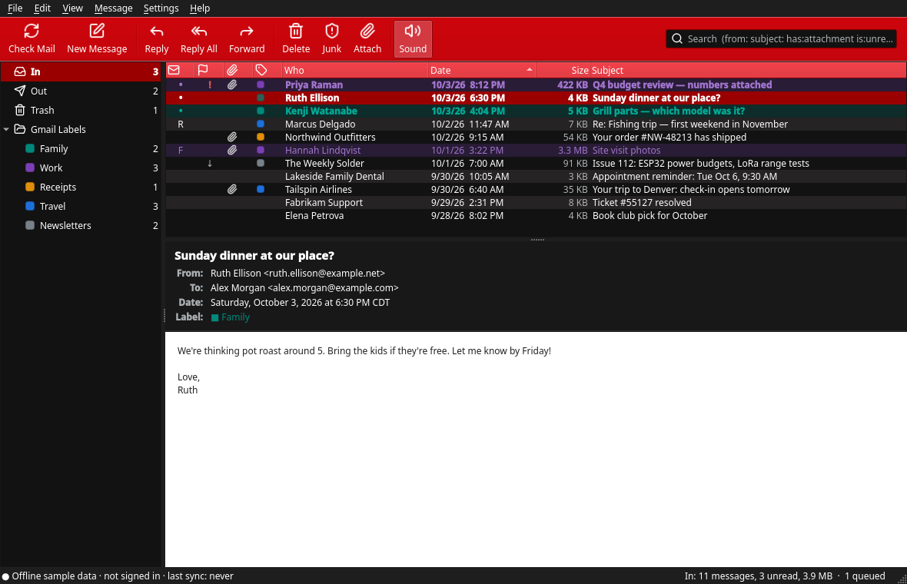
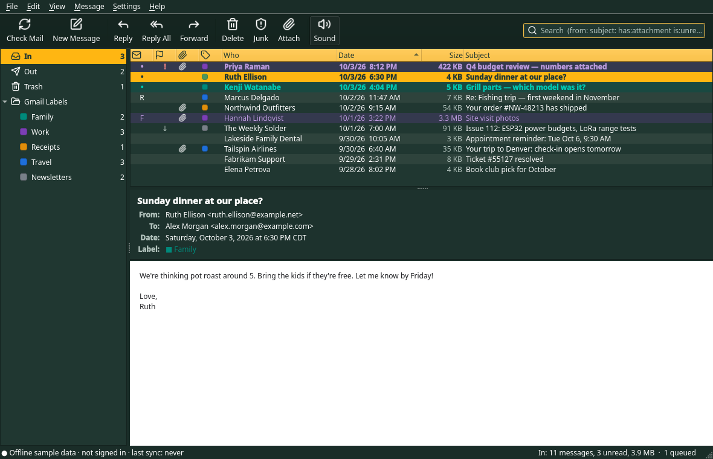
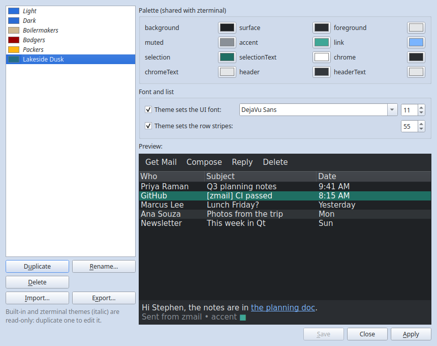
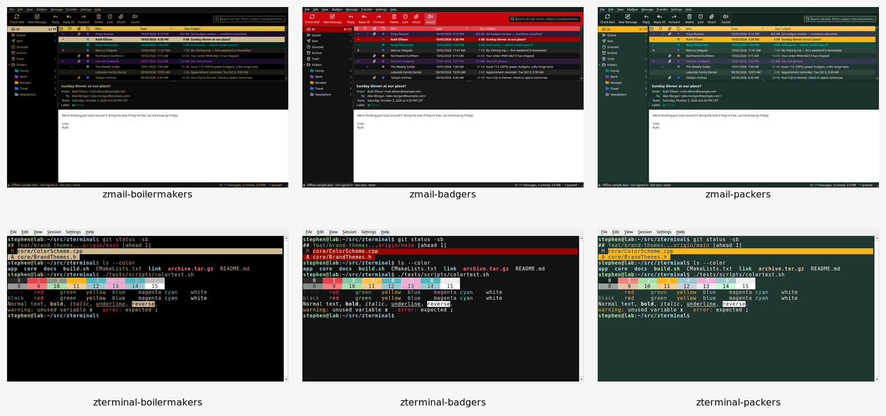

# zmail

A local Linux desktop email client for Gmail that plays a custom sound for
new mail, per sender or per rule, the way Eudora did.

**Status:** v0.5.10: Gmail sign-in, sync (Inbox, labels, read + mark-as-read,
move to Trash, new-mail chime), a reworked message viewer, and sending: New /
Reply / Reply All / Forward, HTML, plain or Markdown, attachments (with the
25 MB check and an optional zip), drafts, signatures and spell check, plus search operators, list right-click
menus with Undo Delete, a sign-in Retry banner, a new-mail sound mute
(Ctrl+Shift+M), and Settings → Sounds (custom WAV, Test, Default). New in
0.4.0: Mark as Junk / Not Junk with a Hide Spam filter, Snooze (presets and a
Snoozed mailbox), full-text search across the local cache, read-only Google
Contacts, the Boilermakers, Badgers and Packers themes, and a Theme Editor
for custom themes (`*.ztheme.json`, shared with zterminal). New in 0.4.1:
security hardening (no local file reads from mail or quoted replies, remote
images default to Ask over HTTPS only with private addresses refused, OAuth
state, header and `mailto:` fixes). New in 0.4.2: Delete works in every
mailbox, not just In: a message deleted from a Gmail label, Starred, Out,
Snoozed, Junk or search results now leaves the list (it stays in Trash, and
Undo Delete still puts it back), and if Gmail refuses the Delete the message
and the selection come back with the error in the status bar. New in 0.5.0:
styled signatures (rich-text editor, sanitized HTML, generated plain text)
and Labels as folders (sidebar counts, New/Rename/Delete Folder, drag-to-move
that peels INBOX / the source user label). New in 0.5.1:
account-status circle in the status bar (green connected, grey offline,
red on sync error). New in 0.5.2:
message list multi-select (Shift/Ctrl range+toggle, bulk Delete/Junk/Snooze/
Mark Read). New in 0.5.3:
Gmail label-count fetch throttle (max in-flight + 429 cooldown) so startup
no longer livelocks the UI thread. New in 0.5.4:
sync fixes (snoozes survive a full resync, a failed fetch no longer skips
mail, folders can't get stuck loading), a faster message list and cache,
interactive Gmail calls ahead of background sync, a stricter HTML sanitizer,
and the theme editor's colour picker no longer freezes it on Wayland. New in 0.5.5:
a zmail app icon (a green Z on a light envelope, matching zterminal's style),
installed at all Linux hicolor sizes, plus a window icon. New in 0.5.6:
mail with deeply nested tables no longer freezes the window (images are
shared rather than copied per layout, table nesting is capped at 8 levels),
Settings → Message List (text size and row spacing), and one folder per
message (a move drops the other labels; drag onto In to move back). New in 0.5.7:
deleting a message takes it out of its folder, and right-click a folder for
Empty Folder. New in 0.5.8: a folder whose list is too short to scroll now
loads the rest of its mail (it could show 2 messages under a count of 212),
and the 0.5.7 startup pass that removed labels from mail in Trash is gone. New in 0.5.9:
Contacts can be organised (categories, your own fields, a comment per
contact) and hidden; all of it local, none of it written to Google. New in 0.5.10:
coloured flags, Empty Trash, dragging a message to a folder works again (a
list reload while the mouse button was down cancelled the drag), and range
selection always starts from the current message. See
[docs/PLAN.md](docs/PLAN.md).

- Linux amd64 first, packaged as a `.deb`
- Gmail over OAuth 2.0 only; no passwords are ever stored, and tokens live in
  the OS keyring (Secret Service / libsecret)
- Local offline cache with full-text search
- C++20, Qt 6 Widgets, CMake/CPack (same stack as
  [zterminal](https://github.com/sbj-ee/zterminal) and
  [zwriter](https://github.com/sbj-ee/zwriter))

## Connect your Gmail

zmail uses **your own** Google OAuth client, so nothing goes through a
third-party server. One-time setup (about 5 minutes):

1. Open [Google Cloud Console](https://console.cloud.google.com/) and create
   (or pick) a project, e.g. `zmail`.
2. **APIs & Services → Library**: search for **Gmail API** and click **Enable**.
3. Open [Google Auth Platform](https://console.cloud.google.com/auth/overview)
   and click **Get started**: app name `zmail`, your email as the support and
   contact address.
4. **Audience**: user type **External**. Click **Publish app** so the status
   is **In production**. It stays *unverified*; that's fine for your own
   account. (Google shows a warning at sign-in, and refresh tokens don't
   expire after 7 days the way they do in Testing.)
5. **Clients → Create client**: application type **Desktop app**, name
   `zmail`, **Create**, then **Download JSON** in the "OAuth client created"
   box right away (Google may not show the secret again). It saves
   `client_secret_….apps.googleusercontent.com.json` to `~/Downloads`.
6. Start `zmail`. The **Connect your Gmail** dialog opens. Click
   **Choose client file…** and pick that file. zmail copies it to
   `~/.config/zmail/oauth-client.json` with mode 0600. (Or do it by hand:
   `install -D -m 600 ~/Downloads/client_secret_*.json ~/.config/zmail/oauth-client.json`.)
   zmail won't sign in while that file is readable by other users; the
   dialog offers **Fix (chmod 600)**.
7. Click **Sign in with Google**. Your browser opens Google's sign-in page.
   Pick your account. On **"Google hasn't verified this app"** click
   **Advanced → Go to zmail (unsafe)**. Tick the box that lets zmail
   **read, compose, and send email**, then **Continue**. The browser tab says
   *zmail is signed in*; switch back to zmail.

zmail asks only for `gmail.modify` plus `openid email` (to show which account
signed in). The refresh token goes to your system keyring (GNOME Keyring /
KWallet via QtKeychain), never to a file; the access token stays in memory.
The mail cache lives in `~/.local/share/zmail/<account>/zmail.db` (mode 0600,
directory 0700). **File → Sign Out** forgets the token and revokes it at Google.
If Google ever rejects the saved sign-in (revoked, password changed), zmail
shows the sign-in dialog again.

`zmail --offline` shows the built-in sample mailbox without connecting.

| First run | Sign in | Synced mailbox (mock data) |
|---|---|---|
|  |  |  |



## Build

```sh
sudo apt install qt6-base-dev qt6-svg-dev qt6-multimedia-dev qtkeychain-qt6-dev \
  libqt6sql6-sqlite libmd4c-dev libmd4c-html0-dev libzip-dev \
  libhunspell-dev hunspell-en-us cmake ninja-build g++
cmake -B build -G Ninja -DCMAKE_BUILD_TYPE=Release
cmake --build build
ctest --test-dir build --output-on-failure
cd build && cpack -G DEB   # zmail_0.5.10_amd64.deb
```

The version lives only in `project(zmail VERSION ...)` in `CMakeLists.txt`.
The tests never talk to Google: they run against an in-process mock of the
OAuth and Gmail endpoints (`tests/mock/MockGoogle`).

## Reading mail

- HTML mail is shown on a white page, laid out to the width of the pane.
  **View → Dark Background for Messages** gives a dark version. Content the
  sender hid (preheaders, dark-mode duplicates) stays hidden, and 600 px
  newsletter cards are centred as in Gmail.
- Remote images: **Settings → Privacy → Remote images** is *Ask* (default:
  a **Load images** bar per message, with **Always for this sender**; the
  allow list is edited or cleared on the same page), *Always load* or
  *Never*. Image requests never carry cookies or credentials, are
  size-capped, use HTTPS only and only go to public addresses (never
  localhost, the LAN or a tailnet), and known tracking pixels (1×1 images,
  read-receipt services) are dropped even in *Always*, unless you untick
  **Block tracking pixels**.
- Emoji in subjects and messages use Noto Color Emoji when it's installed
  (`fonts-noto-color-emoji`, recommended by the .deb).
- Ctrl+= and Ctrl+- (or Ctrl+wheel) zoom the message; Ctrl+0 resets it.
- **View → Preview Pane** shows the preview below the list or to its right;
  by default the message gets about two thirds of the space. Drag the divider to resize it; zmail remembers the layout.
- Double-click a message (or press Ctrl+O) to open it in its own window.
- Labels are folders, and a message is in one folder at a time: dragging it
  onto a label removes it from In and from any other label it had; dragging
  it onto **In** moves it back.
  Deleting a message takes it out of its folder too (Undo Delete puts it
  back). A folder loads more of its mail by itself when the list is too
  short to scroll.
  Right-click a folder for **Empty Folder** (all its mail to Trash) or
  **Delete Folder** (the label only; its mail is kept).
- **Flags** come in seven colours. Click a message's flag column to flag it
  (in the colour used last) or clear it; right-click, or **Message → Flag**,
  to pick a colour, for one message or several. Any flag also stars the
  message in Gmail; the colour is zmail's own. Mail starred elsewhere shows
  a yellow flag.
- Right-click **Trash → Empty Trash** removes everything in it from zmail.
  Gmail does not let a mail client with zmail's permission erase mail, so
  Gmail keeps those messages in its own Trash until it purges them.
- Shift+click and Shift+arrows select a range from the current message, up
  or down.
- **Settings → Contacts** organises the contacts synced from Google: put
  them in categories (a contact can be in several), add your own fields
  (Phone, Company, anything) and a comment, and hide the ones you don't
  want. Hidden contacts leave the list and are not suggested when you write
  a message. All of this stays on your computer; nothing is written to Google.
- **Settings → Message List** sets the message list's text size and the
  space between its rows (Compact / Comfortable / Roomy presets, or any value).
- **Settings → Row Stripes** sets how strongly alternate rows in the message
  list are shaded (a slider with Off / Subtle / Normal / Strong presets).

## Themes

**View → Theme** offers Light (default), Dark, Follow System and three brand
themes: **Boilermakers** (Purdue gold on black), **Badgers** (white on UW black
with a Badger Red toolbar and headers) and **Packers** (white on Packers green
with gold headers and selection). zmail remembers the choice (`ui/theme`);
`zmail --theme packers` overrides it for one run. Messages keep their white
page in every theme. The brand palette is shared with
[zterminal](https://github.com/sbj-ee/zterminal); see
[docs/THEMES.md](docs/THEMES.md) for every role, hex value, source and
contrast ratio.

**View → Theme → Theme Editor…** makes custom themes: duplicate any theme
(the brand ones too), pick a colour for each palette role, optionally a UI font
and size and the list's row stripes, with a live preview; then save, rename,
delete, apply, import or export. Custom themes appear in View → Theme and are
`*.ztheme.json` files in `~/.config/zmail/themes/`, a format shared with
zterminal ([docs/THEMES.md](docs/THEMES.md#theme-files-custom-themes)); zterminal's themes in
`~/.config/zterminal/themes/` are listed read-only.

| Boilermakers | Badgers | Packers |
|---|---|---|
|  |  |  |



### Shared with zterminal

The themes work the same way in both apps. Boilermakers, Badgers and Packers
are built into zmail and [zterminal](https://github.com/sbj-ee/zterminal) with
the same palette, and custom themes move between them as `*.ztheme.json`
files: **Export…** in one app's Theme Editor writes `<name>.ztheme.json`, and
**Import…** in the other app's editor copies it into that app's themes folder.
If both apps run under the same user, each one also lists the other's custom
themes read-only without importing. zmail keeps but ignores a theme's terminal
colours; zterminal derives terminal colours for a theme made in zmail. The
format, the file locations and how missing colours are filled in are in
[docs/THEMES.md](docs/THEMES.md).



## New-mail sound

When new INBOX mail arrives (while zmail is already running), zmail plays a
short built-in two-note chime once per sync batch. Mute it from **View → Play
Sound for New Mail**, the toolbar speaker, or **Ctrl+Shift+M**. **Settings →
Sounds** turns the chime on or off, lets you **Browse…** for a custom `.wav`,
**Default** resets to the bundled sound, and **Test** previews the current
choice. A missing or unreadable custom file falls back to the built-in chime
(`assets/sounds/new-mail.wav`, also embedded in the binary via Qt resources).

## License

MIT. See [LICENSE](LICENSE).
